# Akaonty-iT

Flutter app to manage expense, economy and debts.

## Features

- Managet expenses by month supporting income and outcome
- Manage personal economy account with support of deposit and withdrawal
- Manage personal debts with support of self debts and others debts to self

## How to build

- Clone the repo
- cd to the project folder and run dart pub get
- run "flutter run"

## Future plan

- Add online synchronization 

## Screenshots

<table>
    <tr>
        <td>
         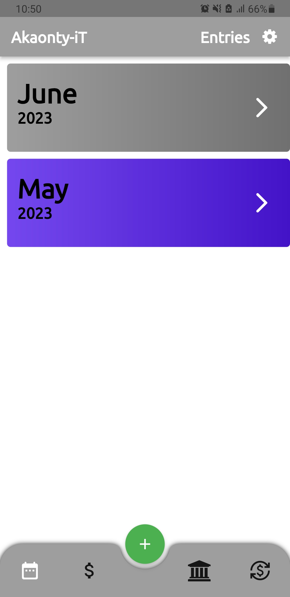
        </td>
        <td>
         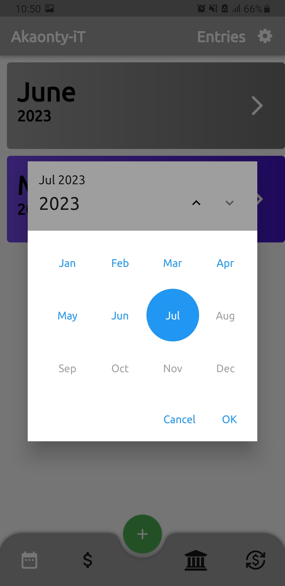
        </td>
        <td>
         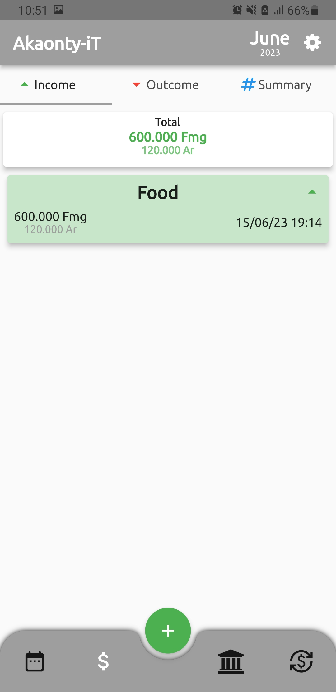
        </td>
        <td>
         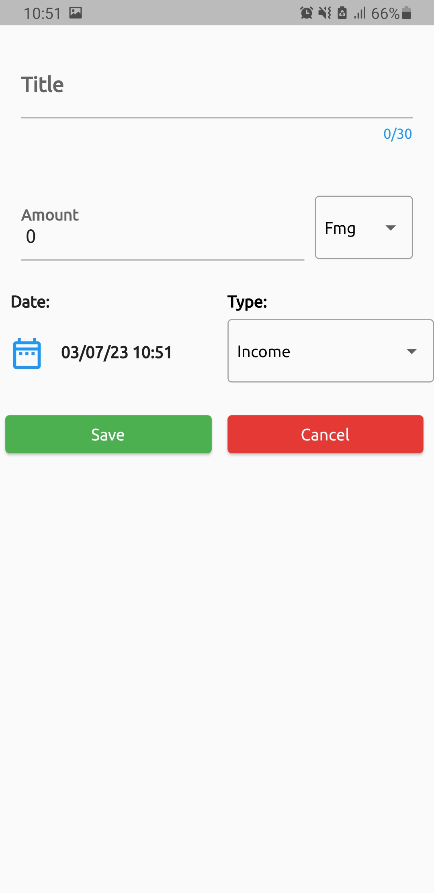
        </td>
    </tr>
    <tr>
        <td>
         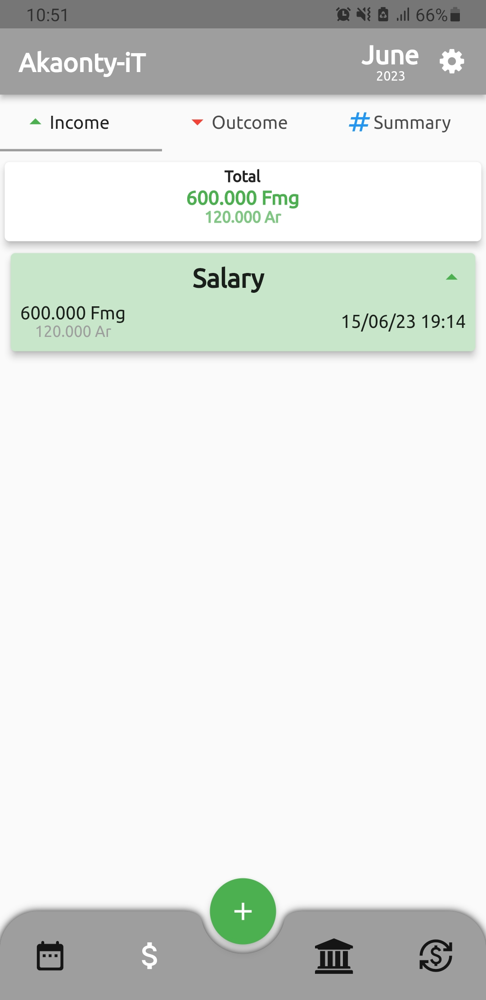
        </td>
        <td>
         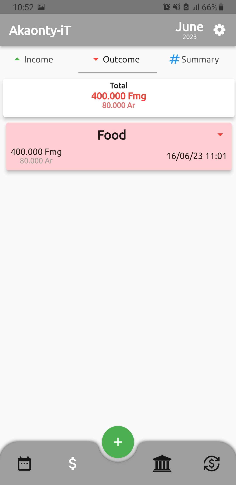
        </td>
        <td>
         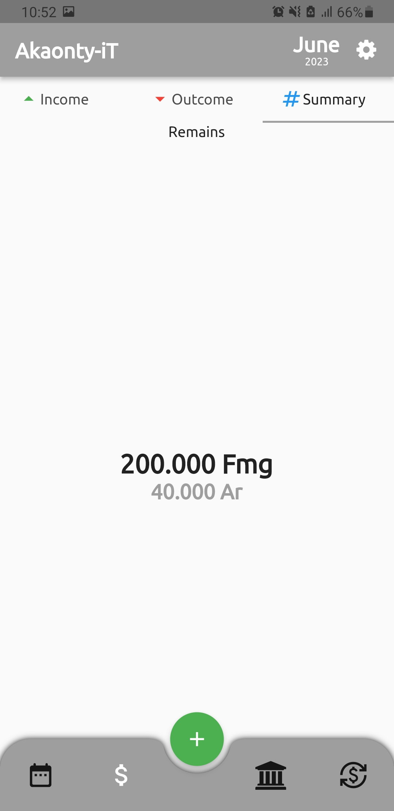
        </td>
        <td>
         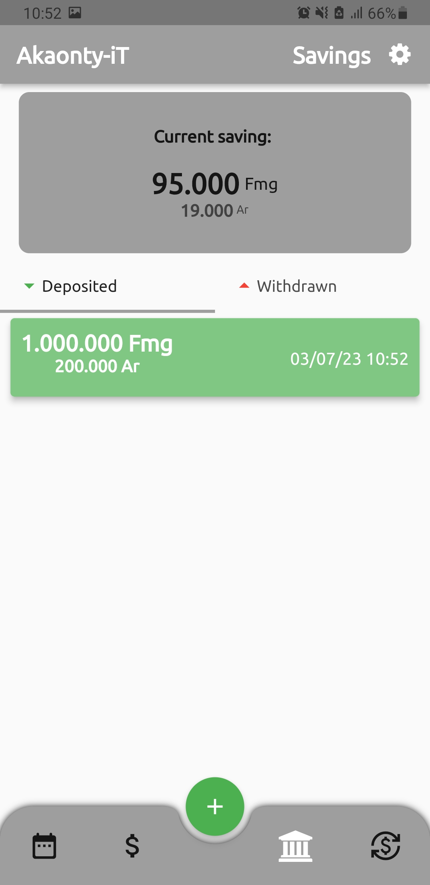
        </td>
    </tr>
    <tr>
        <td>
         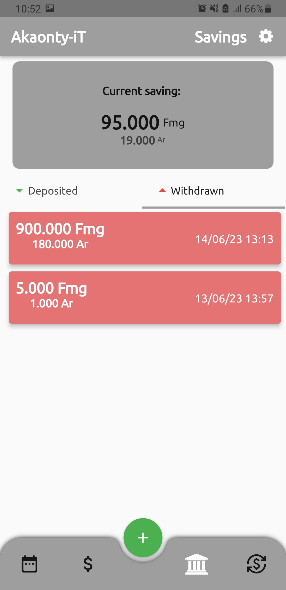
        </td>
        <td>
         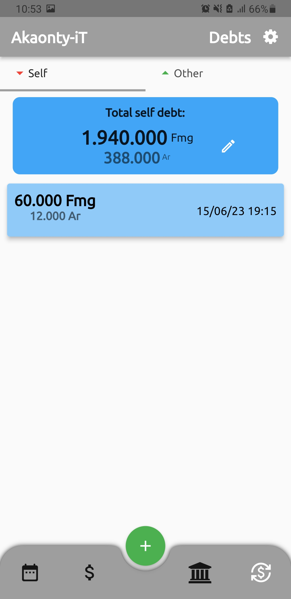
        </td>
        <td>
         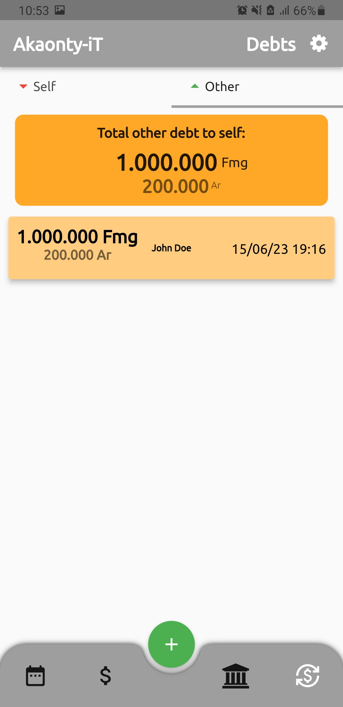
        </td>
    </tr>
</table>